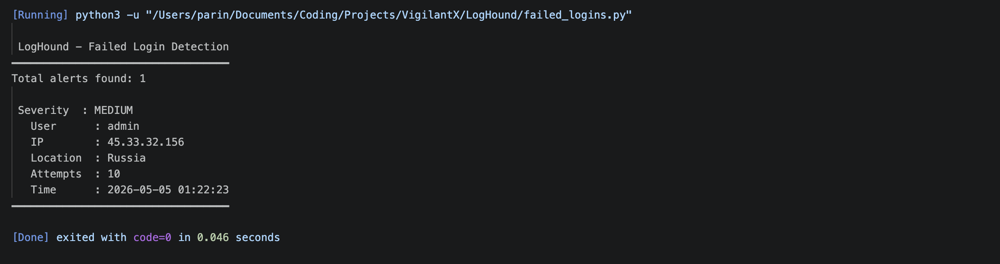
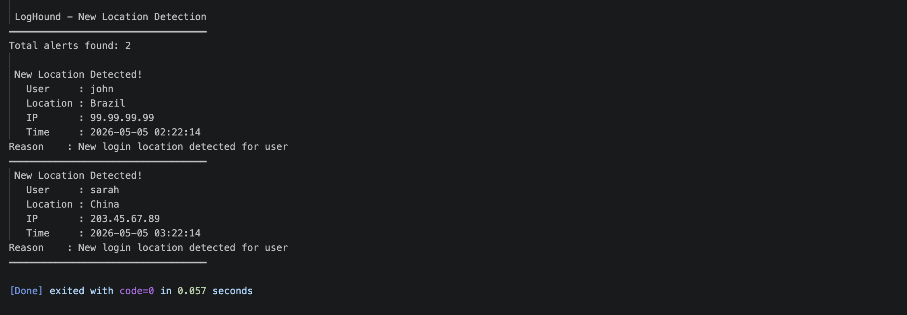
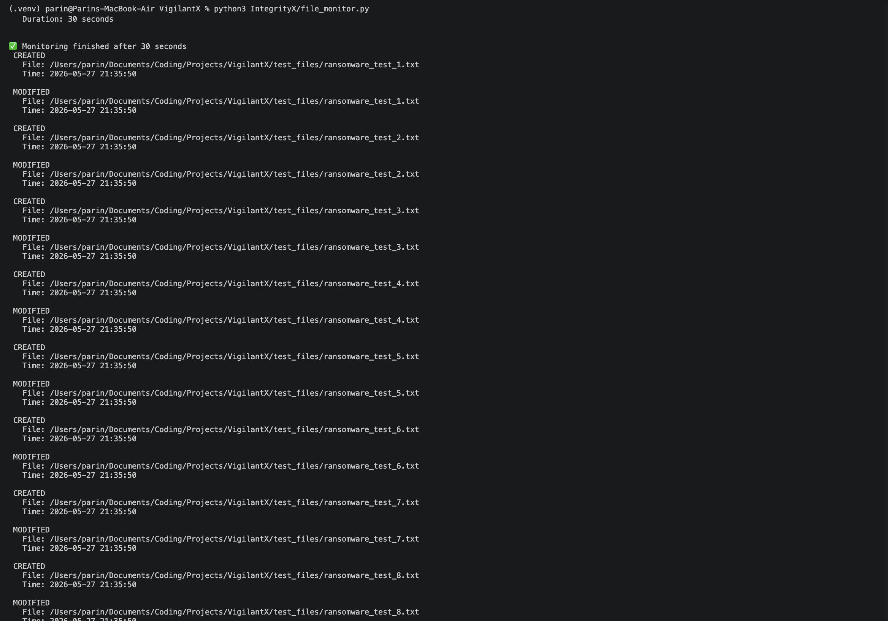
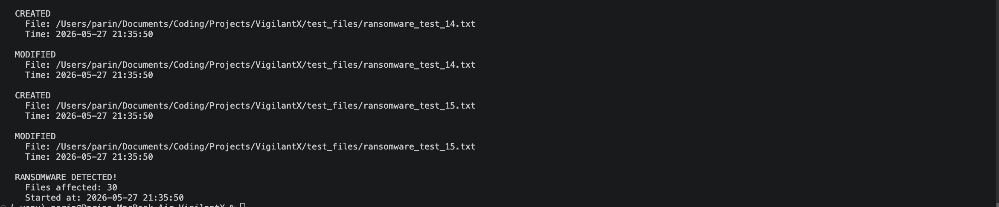
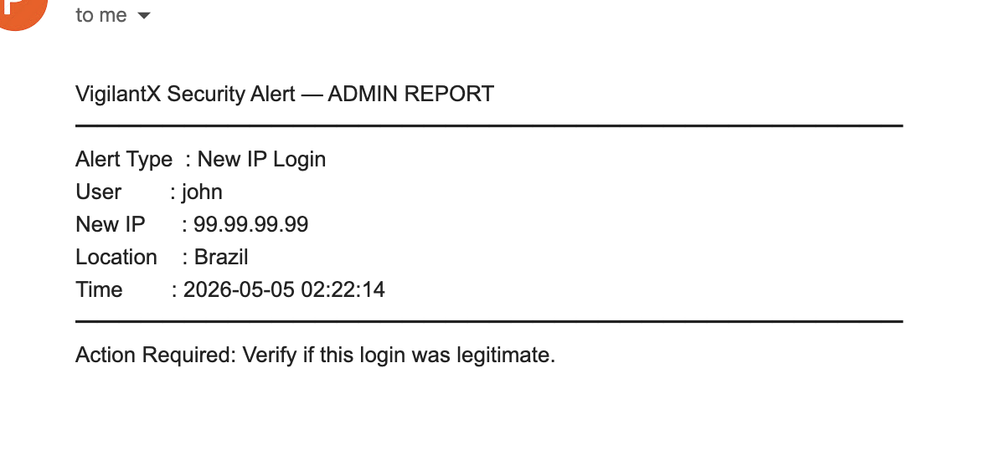
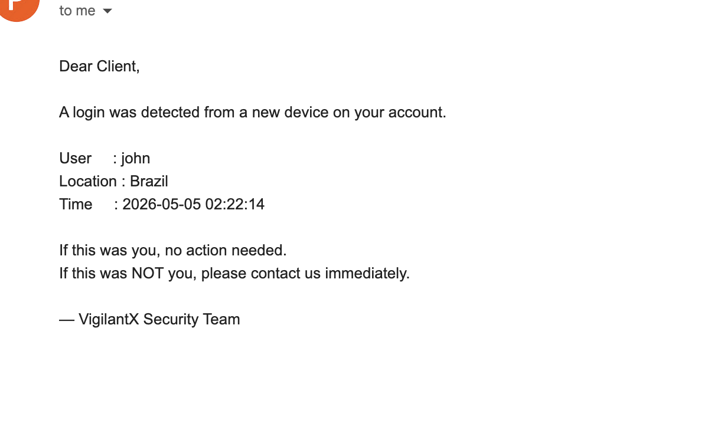

# VigilantX

Real-time security monitoring system for detecting suspicious login activity and file integrity threats.

Built during Summer 2026 as a cybersecurity and systems monitoring project.

---

## Features

### LogHound — Login Activity Monitoring

Detects suspicious authentication activity from login logs:

- Brute force attacks  
  *(10+ failed login attempts within 5 minutes)*
- Logins from new IP addresses
- Logins from new geographic locations

### IntegrityX — File Integrity Monitoring

Monitors files and directories in real time:

- File creation detection
- File modification detection
- File deletion detection
- File rename detection
- Ransomware-like behavior detection  
  *(10+ rapid file changes)*

### Notifications

Automatically sends email alerts:

- **Admin alerts** → detailed technical information
- **Client alerts** → simplified plain-English summaries

---

## Tech Stack

- Python
- Watchdog
- Pandas
- Flask
- SMTP Email Automation
- python-dotenv

---

## Screenshots

### Brute Force Detection



### New IP / Location Detection



### File Integrity Monitoring



### Ransomware Detection



### Email Alert to Admin Example



### Email Alert to Client Example



---

## Project Structure

```text
VigilantX/
├── LogHound/
│   ├── failed_logins.py
│   ├── new_ip.py
│   ├── new_location.py
│   └── log_analyzer.py
│
├── IntegrityX/
│   └── file_monitor.py
│
├── Notifications/
│   ├── admin_alert.py
│   └── client_alert.py
│
├── logs/
│   ├── auth.log
│   └── generate_logs.py
│
├── screenshots/
│   ├── bruteforce.png
│   ├── new_login.png
│   ├── file_monitor.png
│   ├── ransomware.png
│   └── email_alert.png
│
├── test_files/
│
└── .env
```

---

## How It Works

### Login Monitoring Flow

```text
Login Logs → LogHound → Threat Detection → Email Alerts
```

### File Monitoring Flow

```text
File Activity → IntegrityX → Suspicious Behavior Detection → Email Alerts
```

---

## Setup

### 1. Clone the repository

```bash
git clone https://github.com/Parinn7/VigilantX.git
cd VigilantX
```

### 2. Create a virtual environment

```bash
python3 -m venv .venv
```

### 3. Activate the virtual environment

#### macOS / Linux

```bash
source .venv/bin/activate
```

#### Windows

```bash
.venv\Scripts\activate
```

### 4. Install dependencies

```bash
pip install watchdog flask pandas python-dotenv
```

### 5. Create a `.env` file

```env
SENDER_EMAIL=yourgmail@gmail.com
SENDER_PASSWORD=your_app_password
ADMIN_EMAIL=admin@example.com
CLIENT_EMAIL=client@example.com
```

> Use a Gmail App Password instead of your normal Gmail password.

---

## Running the Project

### Generate test logs

```bash
python3 logs/generate_logs.py
```

### Run login monitoring

```bash
python3 LogHound/log_analyzer.py
```

### Run file integrity monitoring

```bash
python3 IntegrityX/file_monitor.py
```

---

## Testing

### Test File Change Detection

```bash
echo "test" >> test_files/document1.txt
```

### Test File Creation Detection

```bash
touch test_files/newfile.txt
```

### Test File Deletion Detection

```bash
rm test_files/document2.txt
```

### Test Ransomware Detection

```bash
for i in {1..15}; do
    touch test_files/ransomware_test_$i.txt
done
```

IntegrityX will trigger a ransomware alert after detecting rapid file activity.

---

## Example Threat Scenarios

The generated test logs include:

- 15 failed login attempts from Russia
- New IP login from Brazil
- New geographic location login from China

---

## Future Improvements

- Multi-client support
- Dashboard for live monitoring
- Database-backed alert storage
- SIEM integration
- Docker deployment
- Web-based alert management panel

---

## Security Note

Never commit your `.env` file or credentials to GitHub.

Add this to `.gitignore`:

```gitignore
.env
```

---

## Author

Built by **Parin Patel** as a Summer 2026 cybersecurity project.